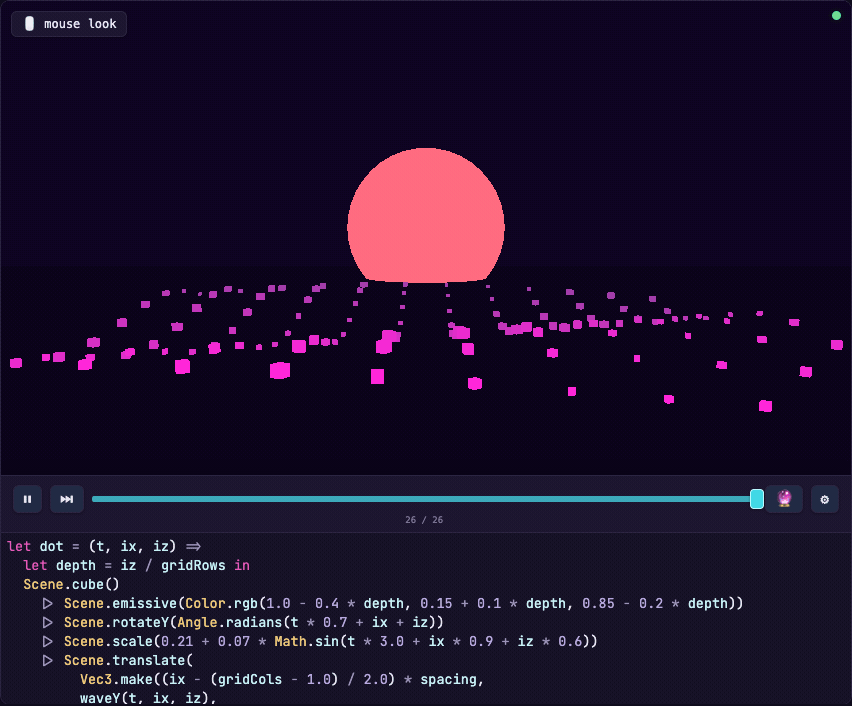
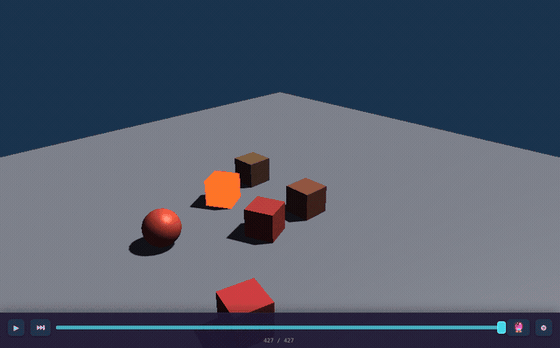
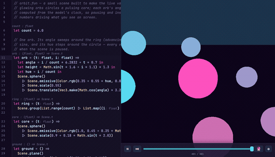
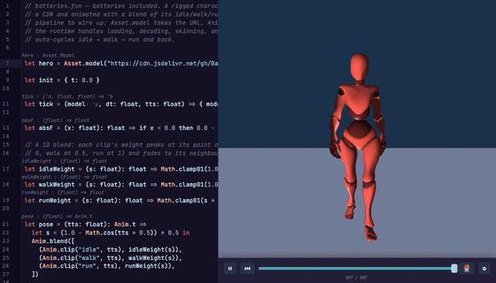
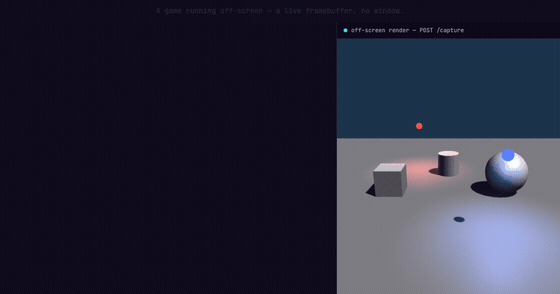

[](https://github.com/tommy-xr/functor/releases) [](https://github.com/tommy-xr/functor/actions/workflows/build-native.yml) [](https://github.com/tommy-xr/functor/actions/workflows/build-wasm.yml)

# functor

> **Note: alpha software.** Functor is early software under active development — the
> language, the prelude, and file formats can all change between releases without a
> deprecation path. Binaries and changelogs are published on the
> [releases page](https://github.com/tommy-xr/functor/releases).



## Core Principles

- __Instant Feedback:__ changes made are instantly applied and visualized - whether that's a code change, an asset change, or the state of a test. You should always be able to tweak and play with the running code.
- __Understandable State:__ the state of the program should be understandable and easily accessible. Many bugs - or complexity - stem from not fully understanding the state.
- __For Humans and Coding Agents:__ the first two bullet points are for _humans._ However, coding agents are here... and they are powerful - functor games are introspectable by coding agents at runtime and headlessly runnable.

## Features

### Time-travel / extrapolation

Use the scrubber bar to move backward and forward in time, and use the extrapolate button to project state forward (replaying key events / other effects in the process) 



> try it yourself at https://functor.games/sandbox?example=mario

### Live evaluation

When a scene is paused, see live values flowing through the system - visualize what code paths were hit and with what values



> Try it yourself at https://functor.games/sandbox?example=orbit

### Batteries included

Asset management, animation, physics, and spatial audio — in the box. Stream a rigged model straight from a URL and the runtime skins and blends its clips; there's no asset pipeline to set up.



> Try it yourself at https://functor.games/sandbox?example=batteries

### AI native

Games run and respond headlessly. Drive and inspect a running game entirely over HTTP — read its live state and render tree, inject input, capture frames — the way a coding agent would.



### Platform support

- __Browser:__ WebAssembly
- __Native Platforms:__ Windows, MacOS, Linux
- __VR/XR__: Quest3, XReal One (planned, not supported yet)

## Try it in the browser

No install needed:

- **[functor.games](https://functor.games)** — the landing page's hero is a live
  Functor Lang scene you can edit in place (the GIF above).
- **[functor.games/sandbox](https://functor.games/sandbox)** — a full
  in-browser sandbox: edit a `.fun`, watch it hot-reload, and scrub the timeline.

## Quick start

**Install a prebuilt binary** — no toolchain needed.

```sh
# macOS / Linux
curl -fsSL https://raw.githubusercontent.com/tommy-xr/functor/main/install.sh | sh
```

```powershell
# Windows (PowerShell)
irm https://raw.githubusercontent.com/tommy-xr/functor/main/install.ps1 | iex
```

This downloads the right binary for your platform into `~/.functor/bin` and prints
the line to add it to your `PATH`. 

> (Prefer to grab it by hand? Download the archive
for your platform from the
[releases page](https://github.com/tommy-xr/functor/releases) and extract the
single `functor` binary)

Then scaffold a game and run it — a window opens; edit `my-game/game.fun` and save
to hot-reload with the model preserved:

```sh
functor -d my-game init         # scaffold a starter project
functor -d my-game run native   # open a window and run it
```

Prefer to build from source? See [DEVELOPMENT.md](DEVELOPMENT.md).

## Technology

Functor is:
- A __language__: a tiny, interpreted, F#/Elm inspired language (`.fun`)
- A __runtime__: a Rust runtime that interprets the `.fun` file and accommodates hot-reload
- An __editor__: at least, a VSCode extension (or editor on the web)

Ultimately, Functor is an _experiment_ - what is game development like with functional programming? And namely if we impose some additional constraints - like pure functions and determinism - can we _improve_ the development experience?

The functor runtime runs in both WebAssembly and native code - you write your game as pure Model-View-Update functions in a `.fun` file. 

None of the ideas in functor are new, every idea here can be traced back to a particular [source of inspiration](INSPIRATION.md)


## Writing a game

Games follow an Elm-style MVU loop: your model is an immutable value, and
`input`/`tick`/`update` are pure functions that return a new model (optionally
paired with an `effect`, whose result is folded back through `update`). `draw`
describes a frame — a camera plus a scene — from the model. A runner-hosted game
defines these top-level Functor Lang bindings:

```functor
let init = { … }                        // the initial model (a value)
let tick = (model, dt, tts) => model'   // per-frame step
let draw = (model, tts) => Frame.create(camera, scene)
let input = (model, key, isDown) => model'         // OPTIONAL; key: Key.t (Key.W, Key.Up, …)
let sampledInput = (model, snapshot: Input.snapshot) => model' // OPTIONAL held/device state
let update = (model, msg) => model'                // OPTIONAL; msgs are ADT variants
let subscriptions = (model) => Sub.every(Time.seconds(1.0), Beat)  // OPTIONAL timers
let physics = (model) => Physics.scene(Vec3.make(0.0, -9.81, 0.0), [body, …]) // OPTIONAL
let soundScape = (model) => AudioScene.create([source, …])         // OPTIONAL looping audio
```

Because the model is a plain, cheap-to-clone value the host holds between frames,
the runtime can **hot-reload your edits with the model preserved** and **record the
model every rendered frame** — that's what powers the live editing and whole-game
time-travel scrubber you see at [functor.games](https://functor.games) (design notes:
`docs/time-travel.md`).

## Running a sample

The bundled sample games live in this repo, so clone it to run them. Some samples
reference glTF model assets that aren't checked in (they download from
[BabylonJS Assets](https://github.com/BabylonJS/Assets/)); fetch them first:

```sh
npm run fetch:assets
```

The CLI operates on a directory containing a `functor.json`
(`{"language": "functor-lang", "entry": "game.fun"}`). Point it at the example with `-d`.
The `run` command interprets the game's `.fun` and launches it — no build step:

```sh
# Native — opens a window
functor -d examples/hello run native

# A primitives-only sample (no assets needed)
functor -d examples/primitives run native

# A 4×4 km, 16-bit heightmap terrain with LOD, collision, and instanced grass
functor -d examples/terrain run native

# Web — serves the .fun + wasm bundle at http://127.0.0.1:8080
functor -d examples/primitives run wasm
```

`native` is the default environment, so `... run` is equivalent to `... run native`.
XR games can use the Quest-isomorphic desktop adapter with
`... run native --emulate-xr`; see [the VR guide](docs/vr.md#desktop-xr-emulation)
for its mouse/keyboard controls and deterministic `--input-script` path.
(These commands assume `functor` is on your `PATH`; when running from a source build,
use `./target/release/functor` instead — see [DEVELOPMENT.md](DEVELOPMENT.md).)

### CLI commands

| Command | Description |
| --- | --- |
| `functor -d <dir> init [3d\|fps]` | Scaffold a new Functor Lang project (`3d` is the default) |
| `functor -d <dir> build [native\|wasm]` | Typecheck the `.fun` project (diagnostics are errors) |
| `functor -d <dir> run [native\|wasm]` | Interpret and run the game (native window / browser) |
| `functor -d <dir> develop [native\|wasm]` | Same as `run` — Functor Lang hot-reload is built into the runtime |
| `functor docs [--format markdown\|json]` | Generate the engine API reference from the embedded `.funi` prelude |

For build-from-source instructions and what `build`/`run` do under the hood, see
[DEVELOPMENT.md](DEVELOPMENT.md).

## Open Questions

__Is this actually a good idea or not?__ 

I'm not sure yet. I'm interested to see what a full game looks like in this environment. There are several benefits to the constraints (ie, immutability + determinism = time-travel + extrapolation), but the ergonomics may still be challenging for writing a full game. Remains to be seen!

Makes me think of John Carmack's comments in this [gamasutra article about functional programming](http://www.gamasutra.com/view/news/169296/Indepth_Functional_programming_in_C.php):
> If you are in circumstances where you can undertake significant development work in a non-mainstream language, I'll cheer you on, but be prepared to take some hits in the name of progress.

## Credits

- Demo 3D assets are from [BabylonJS Assets](https://github.com/BabylonJS/Assets/)
  (CC-BY 4.0). `Xbot.glb` (`examples/hello`, `examples/animation`, `examples/crossfade`) is Adobe
  Mixamo's "X Bot" character, distributed via BabylonJS Assets.
- The hand model in `examples/glove` (`vr_glove_model.glb`) is from Valve's
  [SteamVR Unity Plugin](https://github.com/ValveSoftware/steamvr_unity_plugin)
  (© Valve Corporation, BSD-3-Clause — notice at `examples/glove/LICENSE.steamvr`),
  converted to glTF with FBX2glTF.
- Demo audio (`examples/*/*.wav`) is procedurally synthesized — original/CC0, no
  third-party samples. Regenerate with `npm run generate:audio`
  (`scripts/generate-audio.mjs`).
- `examples/asteroids` uses [Kenney](https://kenney.nl) assets (CC0): sounds from
  the [Sci-Fi Sounds](https://kenney.nl/assets/sci-fi-sounds) pack and the ship
  model (`craft_racer`) from the [Space Kit](https://kenney.nl/assets/space-kit)
  (fetched by `npm run fetch:assets`, not checked in). Thanks, Kenney! Details
  per file in `examples/asteroids/ASSETS.md`.
